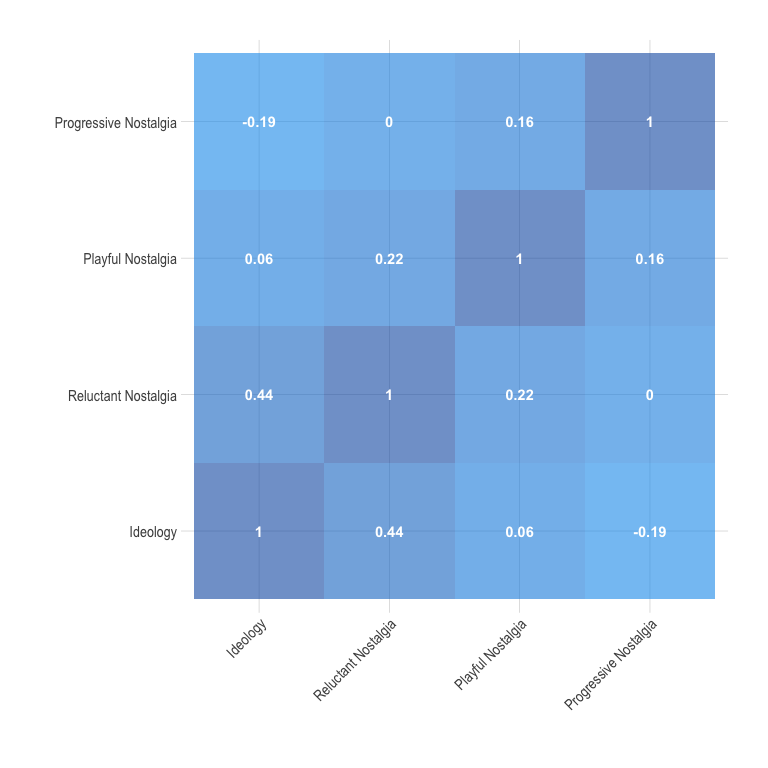
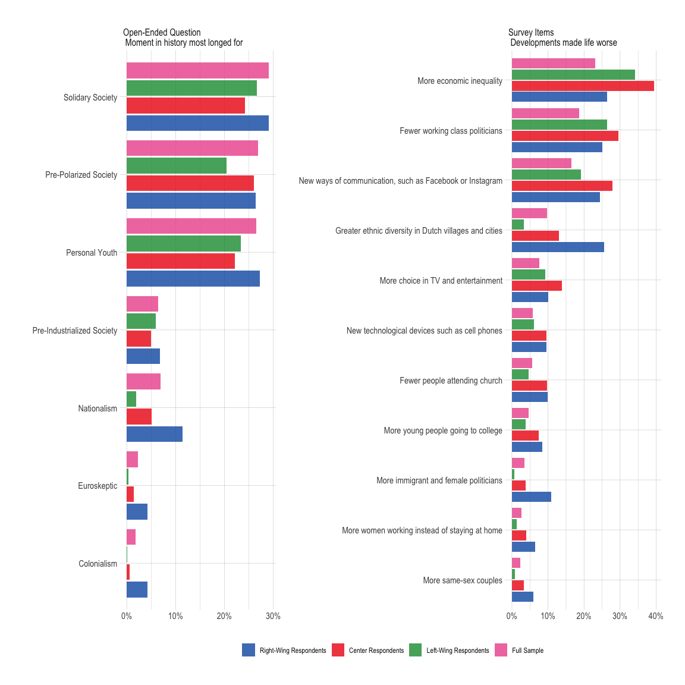

Data Analysis
================

- [Measurement Models – Checks](#measurement-models--checks)
- [Measurement Models – Fig. 1 in
  paper](#measurement-models--fig-1-in-paper)
- [Types of Nostalgia](#types-of-nostalgia)
- [Figure 2](#figure-2)
- [Experiment](#experiment)
- [H3: All voters will be more supportive of nostalgic messages than
  non-nostalgic
  messages](#h3-all-voters-will-be-more-supportive-of-nostalgic-messages-than-non-nostalgic-messages)
  - [Populist voters will be more supportive of messages that mention a
    scapegoat than non-populist
    voters.](#populist-voters-will-be-more-supportive-of-messages-that-mention-a-scapegoat-than-non-populist-voters)
- [Right-wing voters will be more supportive of nostalgic messages than
  left-wing
  voters](#right-wing-voters-will-be-more-supportive-of-nostalgic-messages-than-left-wing-voters)
  - [Figure 4 in paper](#figure-4-in-paper)
  - [Robustness](#robustness)

## Measurement Models – Checks

## Measurement Models – Fig. 1 in paper

## Types of Nostalgia

<table>
<thead>
<tr>
<th style="text-align:right;">
means
</th>
<th style="text-align:left;">
groups
</th>
<th style="text-align:left;">
pval
</th>
</tr>
</thead>
<tbody>
<tr>
<td style="text-align:right;">
0.07
</td>
<td style="text-align:left;">
Other Vote
</td>
<td style="text-align:left;">
sign
</td>
</tr>
<tr>
<td style="text-align:right;">
0.20
</td>
<td style="text-align:left;">
Populist Vote
</td>
<td style="text-align:left;">
sign
</td>
</tr>
<tr>
<td style="text-align:right;">
0.19
</td>
<td style="text-align:left;">
Other Vote
</td>
<td style="text-align:left;">
sign
</td>
</tr>
<tr>
<td style="text-align:right;">
0.36
</td>
<td style="text-align:left;">
Populist Vote
</td>
<td style="text-align:left;">
sign
</td>
</tr>
</tbody>
</table>

    ## [1] "21.19% of people feeling both individually and collectively nostalgic"

## Figure 2

## Experiment

## H3: All voters will be more supportive of nostalgic messages than non-nostalgic messages

### Populist voters will be more supportive of messages that mention a scapegoat than non-populist voters.

## Right-wing voters will be more supportive of nostalgic messages than left-wing voters

### Figure 4 in paper

### Robustness

1.  Exclude centrists

