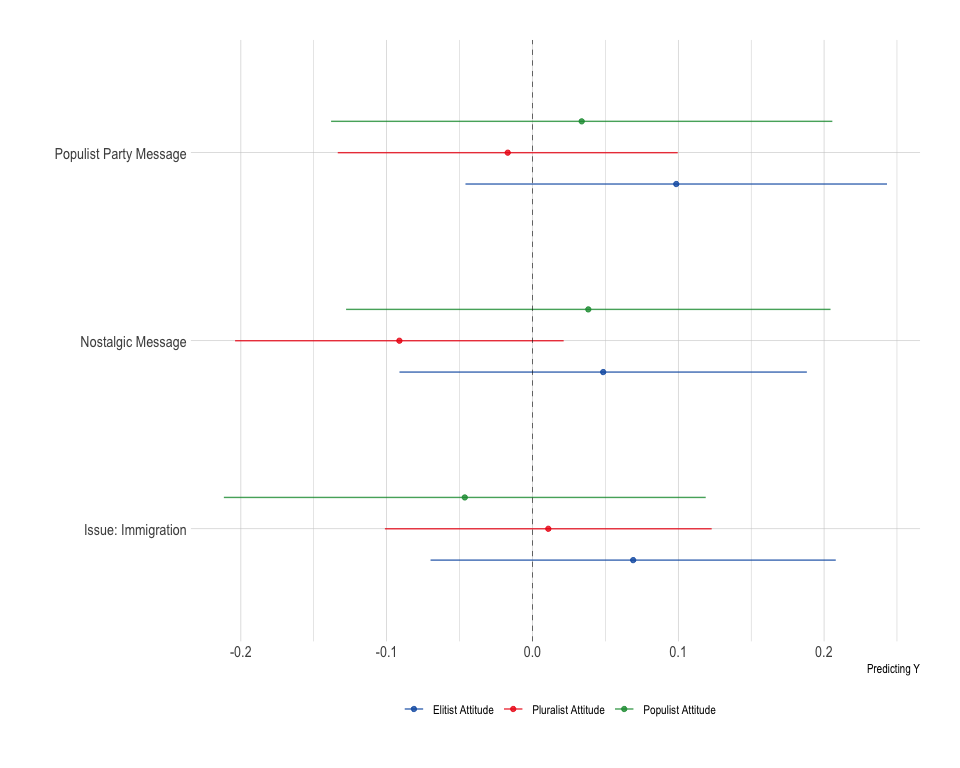
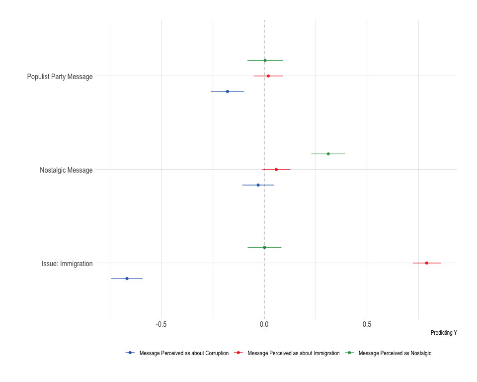
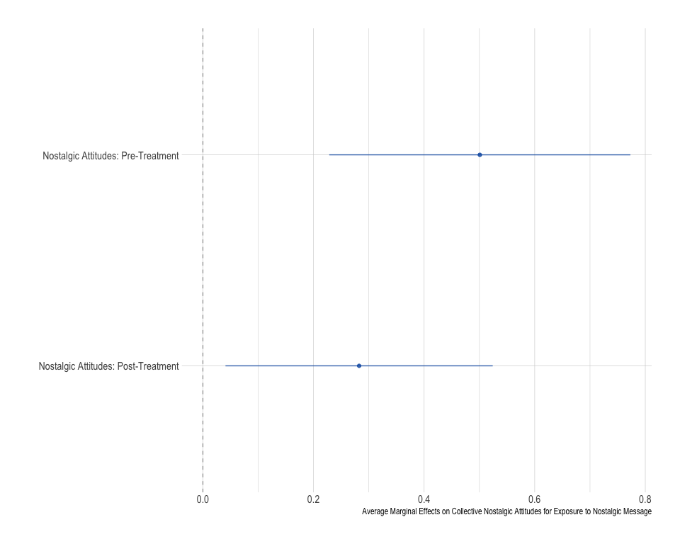
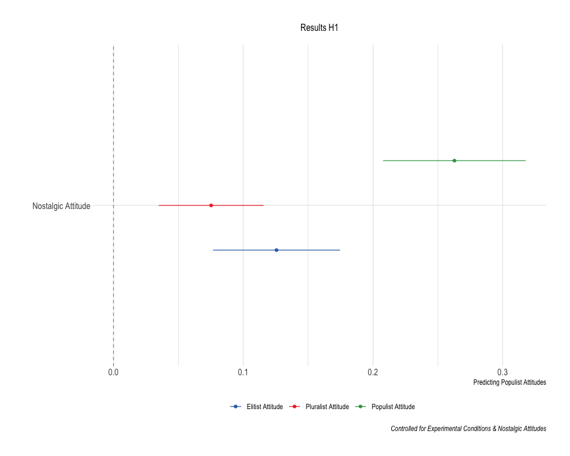
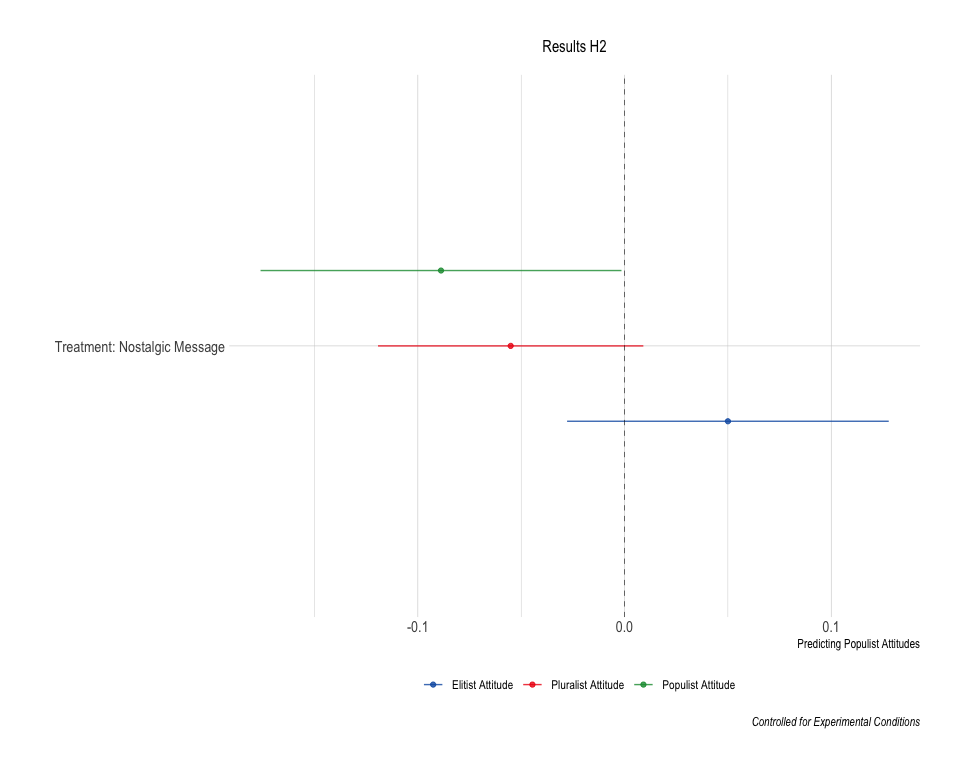
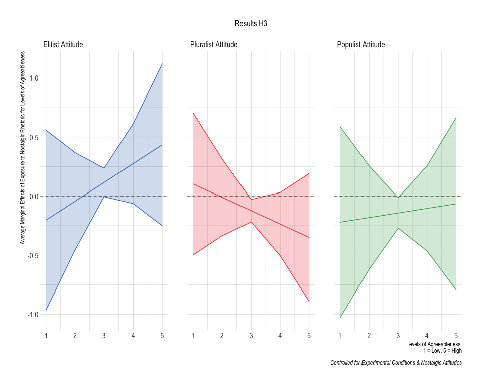

Pilot Study
================

-   [Required Packages &
    Reproducibility](#required-packages--reproducibility)
-   [Pilot Data](#pilot-data)
-   [Differences by Treatment](#differences-by-treatment)
    -   [Populist Party Message or Anonymous Twitter
        User?](#populist-party-message-or-anonymous-twitter-user)
    -   [Nosstalgia Question Pre- or
        Post-Treatment?](#nosstalgia-question-pre--or-post-treatment)
    -   [Pilot Data & Hypotheses](#pilot-data--hypotheses)

## Required Packages & Reproducibility

``` r
rm(list=ls())
source(here::here("src/lib/functions.R"))
#renv::snapshot()
```

## Pilot Data

``` r
load(here("data/intermediate/pilot1.RData")) 
d1 <- d1 %>% 
  select(education, gender, age, ideology, collective_nostalgia,
         populist:elitist, nostalgia:message)

load(here("data/intermediate/pilot2.RData"))
df2 <- d2 %>% 
  select(education, gender, age, ideology, collective_nostalgia,
         populist, pluralist, elitist, nostalgia, issue,
         nostalgic_message, agreeable,
         mc1, mc2, mc3, check_nostalgia,
         check_immigration, check_corruption, message)

d2 <- d2 %>% 
  select(education, gender, age, ideology, collective_nostalgia,
         populist, pluralist, elitist, nostalgia, issue,
         nostalgic_message, mc1, mc2, mc3, check_nostalgia,
         check_immigration, check_corruption, message)

d <- d1 %>% add_row(d2)
```

## Differences by Treatment

### Populist Party Message or Anonymous Twitter User?

``` r
m1 <- tidy(lm(populist ~ as.factor(message) +
                as.factor(issue) + as.factor(nostalgic_message), 
              data = d)) %>% 
  mutate(y = "Populist Attitude")

m2 <- tidy(lm(pluralist ~ as.factor(message) +
                as.factor(issue) + as.factor(nostalgic_message), 
              data = d)) %>% 
  mutate(y = "Pluralist Attitude")

m3 <- tidy(lm(elitist ~ as.factor(message) +
                as.factor(issue) + as.factor(nostalgic_message), 
              data = d)) %>% 
  mutate(y = "Elitist Attitude")

m1 %>% add_row(m2) %>% add_row(m3) %>% 
  filter(term != "(Intercept)") %>% 
  mutate(term = recode(term, 
                       `as.factor(message)party` = "Populist Party Message",
                       `as.factor(issue)immigration` = "Issue: Immigration",
                       `as.factor(nostalgic_message)yes` = "Nostalgic Message"),
         lower = estimate - (1.56 * std.error),
         upper = estimate + (1.56 * std.error)) %>% 
  ggplot(aes(x = term, 
             y = estimate,
             ymin = lower,
             ymax = upper,
             color = y)) +
  geom_point(position = position_dodge(.5)) + 
  geom_errorbar(position = position_dodge(.5), width = 0) +
  theme_ipsum() +
  labs(x = "", y = "Predicting Populist Attitudes") +
  theme(plot.title = element_text(hjust = 0.5),
        plot.subtitle = element_text(hjust = 0.5),
        legend.position="bottom",
        legend.title = element_blank()) +
  scale_color_manual(values = fig_cols) +
  geom_hline(yintercept = 0, size = .2, linetype = "dashed") +
  coord_flip()
```



``` r
m4 <- tidy(lm(check_nostalgia ~ as.factor(message) +
                as.factor(issue) + as.factor(nostalgic_message), 
              data = d)) %>% 
  mutate(y = "Message Perceived as Nostalgic")

m5 <- tidy(lm(check_immigration ~ as.factor(message) +
                as.factor(issue) + as.factor(nostalgic_message), 
              data = d)) %>% 
  mutate(y = "Message Perceived as about Immigration")

m6 <- tidy(lm(check_corruption ~ as.factor(message) +
                as.factor(issue) + as.factor(nostalgic_message), 
              data = d)) %>% 
  mutate(y = "Message Perceived as about Corruption")

m4 %>% add_row(m5) %>% add_row(m6) %>% 
  filter(term != "(Intercept)") %>% 
  mutate(term = recode(term, 
                       `as.factor(message)party` = "Populist Party Message",
                       `as.factor(issue)immigration` = "Issue: Immigration",
                       `as.factor(nostalgic_message)yes` = "Nostalgic Message"),
         lower = estimate - (1.56 * std.error),
         upper = estimate + (1.56 * std.error)) %>% 
  ggplot(aes(x = term, 
             y = estimate,
             ymin = lower,
             ymax = upper,
             color = y)) +
  geom_point(position = position_dodge(.5)) + 
  geom_errorbar(position = position_dodge(.5), width = 0) +
  theme_ipsum() +
  labs(x = "", y = "Predicting Populist Attitudes") +
  theme(plot.title = element_text(hjust = 0.5),
        plot.subtitle = element_text(hjust = 0.5),
        legend.position="bottom",
        legend.title = element_blank()) +
  scale_color_manual(values = fig_cols) +
  geom_hline(yintercept = 0, size = .2, linetype = "dashed") +
  coord_flip()
```



### Nosstalgia Question Pre- or Post-Treatment?

``` r
df <- d %>% 
  mutate(nostalgic_message = ifelse(nostalgic_message == "yes", 1, 0),
         nostalgia = factor(nostalgia))
df <- within(df, nostalgia <- relevel(nostalgia, ref = "pre-treatment"))
m7 <- lm(collective_nostalgia ~ 
                as.factor(nostalgia) * as.factor(nostalgic_message) +
                as.factor(message) + as.factor(issue), 
              data = df)

m7 <- summary(margins(m7, variables = "nostalgia", 
                      at = list(nostalgic_message = 0:1))) %>%
        mutate(lower = AME - (1.56 * SE),
               upper = AME + (1.56 * SE)) 

m7 %>% 
  mutate(nostalgic_message = recode(nostalgic_message, 
                       `0.0000` = "No Nostalgic Message",
                       `1.0000` = "Nostalgic Message")) %>% 
  ggplot(aes(x = nostalgic_message, 
             y = AME,
             ymin = lower,
             ymax = upper,
             color = factor)) +
  geom_point(position = position_dodge(.5)) + 
  geom_errorbar(position = position_dodge(.5), width = 0) +
  theme_ipsum() +
  labs(x = "", y = "Average Marginal Effects on Collective Nostalgic Attitudes for Post-Treatment Measure") +
  theme(plot.title = element_text(hjust = 0.5),
        plot.subtitle = element_text(hjust = 0.5),
        legend.position="none",
        legend.title = element_blank()) +
  scale_color_manual(values = fig_cols) +
  geom_hline(yintercept = 0, size = .2, linetype = "dashed") +
  coord_flip()
```



### Pilot Data & Hypotheses

``` r
m8 <- tidy(lm(populist ~ collective_nostalgia + 
                as.factor(nostalgia) + as.factor(nostalgic_message) +
                as.factor(message) + as.factor(issue), data = d)) %>% 
  mutate(y = "Populist Attitude")
m9 <- tidy(lm(pluralist ~ collective_nostalgia + 
                as.factor(nostalgia) + as.factor(nostalgic_message) +
                as.factor(message) + as.factor(issue), data = d)) %>% 
  mutate(y = "Pluralist Attitude")
m10 <- tidy(lm(elitist ~ collective_nostalgia + 
                 as.factor(nostalgia) + as.factor(nostalgic_message) +
                as.factor(message) + as.factor(issue), data = d)) %>% 
  mutate(y = "Elitist Attitude")

m8 %>% add_row(m9) %>% add_row(m10) %>% 
  filter(term == "collective_nostalgia") %>% 
  mutate(term = recode(term,
                       `collective_nostalgia` = "Nostalgic Attitude"),
         lower = estimate - (1.56 * std.error),
         upper = estimate + (1.56 * std.error)) %>% 
  ggplot(aes(x = term, 
             y = estimate,
             ymin = lower,
             ymax = upper,
             color = y)) +
  geom_point(position = position_dodge(.5)) + 
  geom_errorbar(position = position_dodge(.5), width = 0) +
  theme_ipsum() +
  labs(x = "", y = "Predicting Populist Attitudes",
       caption = "Controlled for Experimental Conditions & Nostalgic Attitudes",
       subtitle = "Results H1") +
  theme(plot.title = element_text(hjust = 0.5),
        plot.subtitle = element_text(hjust = 0.5),
        legend.position="bottom",
        legend.title = element_blank()) +
  scale_color_manual(values = fig_cols) +
  geom_hline(yintercept = 0, size = .2, linetype = "dashed") +
  coord_flip()
```



``` r
m8 %>% add_row(m9) %>% add_row(m10) %>% 
  filter(term == "as.factor(nostalgic_message)yes") %>% 
  mutate(term = recode(term,
                       `as.factor(nostalgic_message)yes` = "Treatment: Nostalgic Message"),
         lower = estimate - (1.56 * std.error),
         upper = estimate + (1.56 * std.error)) %>% 
  ggplot(aes(x = term, 
             y = estimate,
             ymin = lower,
             ymax = upper,
             color = y)) +
  geom_point(position = position_dodge(.5)) + 
  geom_errorbar(position = position_dodge(.5), width = 0) +
  theme_ipsum() +
  labs(x = "", y = "Predicting Populist Attitudes",
       subtitle = "Results H2",
       caption = "Controlled for Experimental Conditions") +
  theme(plot.title = element_text(hjust = 0.5),
        plot.subtitle = element_text(hjust = 0.5),
        legend.position="bottom",
        legend.title = element_blank()) +
  scale_color_manual(values = fig_cols) +
  geom_hline(yintercept = 0, size = .2, linetype = "dashed") +
  coord_flip()
```



``` r
m11 <- lm(populist ~ collective_nostalgia + 
                as.factor(nostalgia) + 
                as.factor(nostalgic_message) * agreeable +
                as.factor(issue), data = df2) 
m11 <- summary(margins(m11, variables = "nostalgic_message", 
                      at = list(agreeable = 1:5))) %>% 
  tibble() %>% 
  mutate(lower = AME - (1.56 * SE),
        upper = AME + (1.56 * SE),
        y = "Populist Attitude")

m12 <- lm(pluralist ~ collective_nostalgia + 
                as.factor(nostalgia) + 
                as.factor(nostalgic_message) * agreeable +
                as.factor(issue), data = df2)
m12 <- summary(margins(m12, variables = "nostalgic_message", 
                      at = list(agreeable = 1:5))) %>% 
  tibble() %>% 
  mutate(lower = AME - (1.56 * SE),
        upper = AME + (1.56 * SE),
        y = "Pluralist Attitude")

m13 <- lm(elitist ~ collective_nostalgia + 
                 as.factor(nostalgia) + 
                 as.factor(nostalgic_message) * agreeable +
                as.factor(issue), data = df2)
m13 <- summary(margins(m13, variables = "nostalgic_message", 
                      at = list(agreeable = 1:5))) %>% 
  tibble() %>% 
  mutate(lower = AME - (1.56 * SE),
        upper = AME + (1.56 * SE),
        y = "Elitist Attitude")

m11 %>% add_row(m12) %>% add_row(m13) %>%  
  ggplot(aes(x = agreeable, 
             y = AME,
             ymin = lower,
             ymax = upper,
             color = y,
             fill = y)) +
  geom_line() + 
  geom_ribbon(alpha = .2) +
  theme_ipsum() +
  labs(x = "Levels of Agreeableness \n 1 = Low, 5 = High", y = "Average Marginal Effects of Exposure to Nostalgic Rhetoric for Levels of Agreeableness",
       subtitle = "Results H3",
       caption = "Controlled for Experimental Conditions & Nostalgic Attitudes") +
  facet_grid(.~y) +
  theme(plot.title = element_text(hjust = 0.5),
        plot.subtitle = element_text(hjust = 0.5),
        legend.position="none",
        legend.title = element_blank()) +
  scale_color_manual(values = fig_cols) +
  scale_fill_manual(values = fig_cols) +
  geom_hline(yintercept = 0, size = .2, linetype = "dashed") 
```


